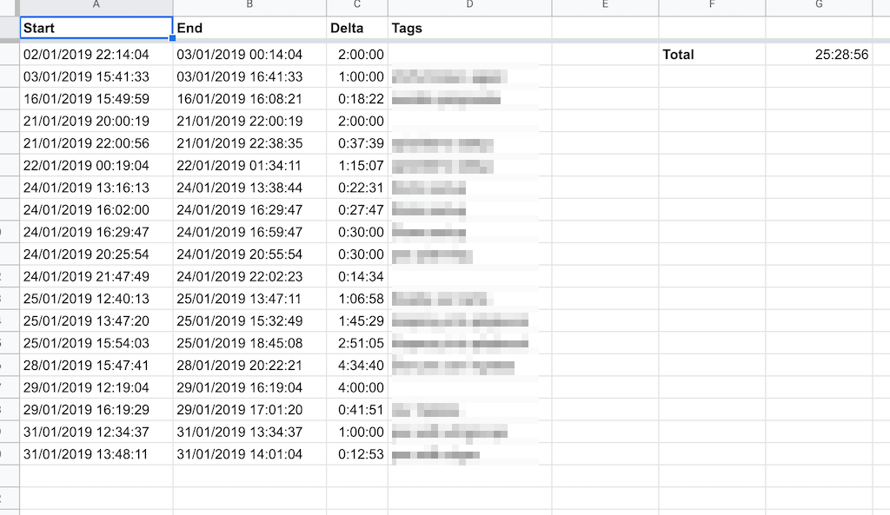

# Timewarrior to GSheets

Exports [Timewarrior](https://taskwarrior.org/docs/timewarrior/index.html) summaries from CLI:

    ❯ timew summary :lastmonth

    Wk Date       Day Tags                     Start      End    Time    Total
    W1 2019-01-02 Wed yxzyx  xyxyyxzyzyxyyx 23:14:04  0:00:00 0:45:56  0:45:56
    W1 2019-01-03 Thu yxzyxzyxyxyyxzyzyxyyx  0:00:00  1:14:04 1:14:04
                      yxzyxzyxyxyyxz  xy  x 16:41:33 17:41:33 1:00:00  2:14:04
    W3 2019-01-16 Wed yx yxzyxyxyyxzyzyxyyx 16:49:59 17:08:21 0:18:22  0:18:22
    W4 2019-01-21 Mon yxzyxzyx   yxzyzyxyyx 21:00:19 23:00:19 2:00:00
                      yxzyxzyxyxyyxzyzyxyyx 23:00:56 23:38:35 0:37:39  2:37:39
    W4 2019-01-22 Tue yxzyxzyxyxyyxzy  xyyx  1:19:04  2:34:11 1:15:07  1:15:07
    W4 2019-01-24 Thu yxzyxzyxyxyyxzyzyxyyx 14:16:13 14:38:44 0:22:31
                      yxzyxzyxyxyyxzyzyxyyx 17:02:00 17:29:47 0:27:47
                      yxzyxzyxyxy xzyzyxyyx 17:29:47 17:59:47 0:30:00
                      yxzyxz   xyyxzyzyxyyx 21:25:54 21:55:54 0:30:00
                      yxzyxzyxyxyyxzyz  yyx 22:47:49 23:02:23 0:14:34  2:04:52
    W4 2019-01-25 Fri yxzyxzyxyxyyxzyzyxyyx 13:40:13 14:47:11 1:06:58
                      yxzyx  xyxyyxzyzyxyyx 14:47:20 16:32:49 1:45:29
                      yxzyxzyxyxyyxzyzyxyyx 16:54:03 19:45:08 2:51:05  5:43:32
    W5 2019-01-28 Mon yxzyxzyxyxyy zyzyxyyx 16:47:41 21:22:21 4:34:40  4:34:40
    W5 2019-01-29 Tue yxzyxzyxyxyyxzyzyxyyx 13:19:04 17:19:04 4:00:00
                      yxzyxzyxyxyyxzyzyx yx 17:19:29 18:01:20 0:41:51  4:41:51
    W5 2019-01-31 Thu yxzyx yxyxyyxzyzyxyyx 13:34:37 14:34:37 1:00:00
                      yxzyxzyxyxyyxzyzyxyyx 14:48:11 15:01:04 0:12:53  1:12:53

                                                                      25:28:56

to Google Sheets:

This app leverages TimeWarrior's Extension API and of course Google APIs. Once installed as an TW extension, just by running `timew to-sheets`, all TW data will be sent to Google Sheets.

## Installing & configuration
1. Download the latest release from the Releases page and copy the binary to `~/.timewarrior/extensions/`
2. Set the environment variable `TW_SPREADSHEET_ID` to the Spreadsheet ID to be modified.
    - You can get your ID by checking out the sheet's url. For the URL: "https://docs.google.com/spreadsheets/d/f00b4r/edit#gid=12019", the ID would be "f00b4r"
3. Simply run `timew to-sheets`, and follow the instructions
    - You can also provide filters to TimeWarrior. For example, `timew :lastmonth to-sheets` would only export last month's data.
    - A new sheet is created for each month. If the sheet ID exists, it is overwritten.

## Forking
1. Fork away
2. Generate your OAuth2 credentials file (read below)
3. Place it into `gsheets/creds/credentials.json`
4. If creating a new release, run `make release`. It will:
    - Generate a new `credentials.go` based off your json
    - Build your binary
    - Pack your .tar.gz versioned using the contents of `version.txt`

### Credentials
For running the application from source, you need to authenticate the application to Google. This is done via an OAuth2 generated credentials file. More information: https://developers.google.com/identity/protocols/OAuth2InstalledApp

The file `gsheets/credentials.go` provides the creds data using two mechanisms: First it will try to serve a local `credentials.json`, but if is not found, it will serve a local slice array.  
The rationale is to have your own json file with your client key/secret, and `.gitignore` it; then, when running locally, use it to authenticate, but when a release is done, embed it into `credentials.go`. Embedding is done via `gsheets/creds/credgen.go` which generates the aforementioned file.  
A Git pre-commit hook prevents from accidentally leaving the credentials in plain text in the Go file.  
Note: Obviously, the recovery of the credentials file is possible via decompiling the binary, but just committing it would be just too easy.

## TODO
- Add timing information
- Enforce TW configuration (debug/verbose)
- Tests